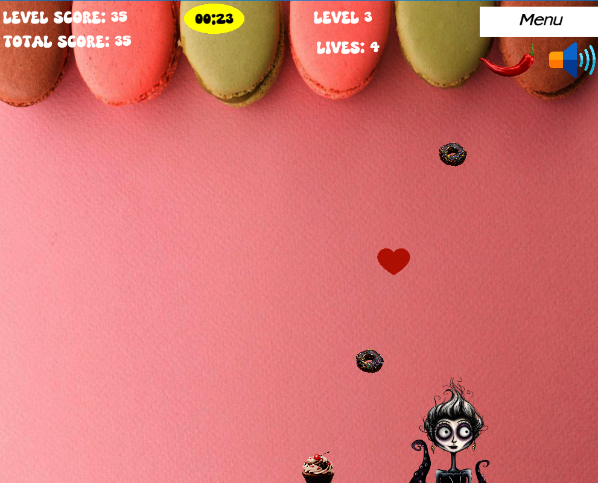

# Dodger Game

Welcome to **Dodger**, a fast-paced arcade game where you control a player character to catch falling objects while avoiding dangerous ones! Test your reflexes and strategy as you progress through levels, earn points, and try to survive as long as possible.

---

## Gameplay

### Objective
- **Catch Good Objects**: Earn points by catching falling objects. Different objects have different point values:
  - **High Value**: 30 points
  - **Medium Value**: 15 points
  - **Low Value**: 5 points
- **Avoid Bad Objects**: Lose a life if you collide with a bad object. You start with **5 lives**, and the game ends if you lose all of them.
- **Complete Levels**: Each level lasts **40 seconds**. Survive the timer to advance to the next level.

### Controls
- **Left Arrow (←)**: Move the player to the left.
- **Right Arrow (→)**: Move the player to the right.
- **Spacebar**: Pause the game.

---

## Features

### Game Modes
- **Main Menu**: Start the game, select levels, view instructions, or exit.
- **Playing Mode**: The main gameplay mode where you catch objects and avoid dangers.
- **Game Over**: Displayed when you lose all your lives. Click "Restart" to try again.
- **Victory**: Displayed when you complete all levels. Celebrate your win and restart the game.
- **Level Selection**: Choose a specific level to play.
- **How to Play**: Learn the rules and controls of the game.

### UI Elements
- **Score**: Displays your current level score and total score.
- **Timer**: Shows the remaining time for the current level.
- **Lives**: Indicates how many lives you have left.
- **Buttons**: Interactive buttons for navigation (e.g., Start, Restart, Menu).

### Audio
- **Sound Effects**: Enjoy immersive sound effects for catching objects, collisions, and level completion.
- **Mute/Unmute**: Toggle audio on or off using the speaker icon in the top-right corner.

---

## How to Play

1. **Start the Game**: Click the "Start" button on the main menu.
2. **Move the Player**: Use the left and right arrow keys to move your character.
3. **Catch Objects**: Collect good objects to earn points and avoid bad objects to preserve your lives.
4. **Pause the Game**: Press the spacebar to pause and resume the game.
5. **Complete Levels**: Survive the timer to advance to the next level.
6. **Restart**: If you lose all lives or complete all levels, use the "Restart" button to play again.

---

## Installation

### Prerequisites
- Ensure you have [Rust](https://www.rust-lang.org/) installed on your system.

### Steps

- Clone the repository:
 ```
git clone https://github.com/kareglazie/dodger.git 
```

- Navigate to the project directory:

```
cd dodger
```

- Build and run the game:
 

```
cargo run --release
```

### Precompiled Windows Executable
If you're on Windows and don't want to compile the game yourself, you can download a precompiled executable from the [Releases](https://github.com/kareglazie/dodger/releases/tag/v1.8.0) page.

### Cross-Platform Compilation
To compile the game for different platforms, refer to the official [ggez documentation](https://github.com/ggez/ggez/blob/master/docs/BuildingForEveryPlatform.md) for detailed instructions on setting up your environment for cross-compilation.

---

## Screenshots

### Main Menu


### Playing Mode Example


### How to Play


## Contributing

Contributions are welcome! If you'd like to contribute to the project, please follow these steps:

-  Fork the repository.
    
-  Create a new branch for your feature or bugfix.
    
-  Submit a pull request with a detailed description of your changes.

## Acknowledgments

-   **ggez**: Thanks to the  `ggez`  team for providing an excellent game development framework.
    
-   **assets**: All game assets (images, sounds) are sourced from free resources.
    
----------

Enjoy the game, and good luck dodging! 🎮


